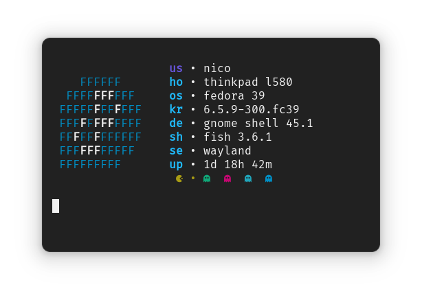

<div align="center">
 
 <h1>yasfetch</h1>
</div>

**yasfetch**, yet anoter fetch, is a simple fetch info only for **Fedora** and **Gnome**

## Requirements
[Nerd Fonts](https://www.nerdfonts.com/font-downloads)

## Instalation & Run
```bash
git clone "https://github.com/Nico1942/yasfetch.git"
cd yasfetch
chmod +x yasfetch
./yasfetch
```

## Thanks

[ufetch](https://gitlab.com/jschx/ufetch): Color schema

[rxfetch](https://github.com/Mangeshrex/rxfetch): Pacman color

[myfetch](https://github.com/Pippadi/myfetch): ascii logo

[pfetch](https://github.com/dylanaraps/pfetch): host script
